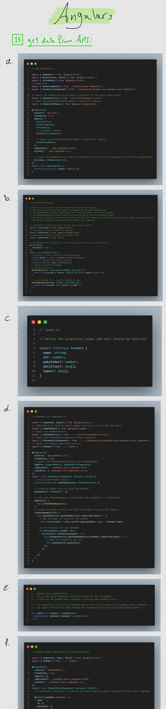

# AngularPokeApp

This project was generated with [Angular CLI](https://github.com/angular/angular-cli) version 17.3.10.

## over the project

I built this project to learn Angular practically after learning about it theoretically.

## To do list:

- [x] The user must be able to see all of the following stories on either PC, Tablet of Mobile (Responsive)
- [x] The user must be able to see a list of pokemons in the styled overview
- [x] The user must be able to see the sidebar and its content
- [x] The user must be able to use the 'more' popup of a single Pokemon
- [x] The user must be able to favorite a Pokemon
- [x] The user must be able to open a single Pokemon in a Modal View
- [x] The user must be able to see all the stats of a pokemon in three tabs
- [x] The user must be able to see an overview of all their favorite Pokemons on a different page/route
- [ ] The user should see a 'not found' page when the route is not identified
- [ ] The user should be able to search through all the pokemons
- [x] The user should be able to switch to darkmode in the sidebar
- [ ] Search loading states (spinner of skeleton loading)
- [ ] "Not found" search empty state
- [ ] Favorites empty state
- [ ] Pokemon battle functie?
- [ ] The user could be treated with nice animations throughout the app

## Development server

Run `ng serve` for a dev server. Navigate to `http://localhost:4200/`. The application will automatically reload if you change any of the source files.

## Code scaffolding

Run `ng generate component component-name` to generate a new component. You can also use `ng generate directive|pipe|service|class|guard|interface|enum|module`.

## Build

Run `ng build` to build the project. The build artifacts will be stored in the `dist/` directory.

## Running unit tests

Run `ng test` to execute the unit tests via [Karma](https://karma-runner.github.io).

## Running end-to-end tests

Run `ng e2e` to execute the end-to-end tests via a platform of your choice. To use this command, you need to first add a package that implements end-to-end testing capabilities.

## Further help

To get more help on the Angular CLI use `ng help` or go check out the [Angular CLI Overview and Command Reference](https://angular.io/cli) page.

## Study notes

1- What is? | 2- Deploying | 3- P.Structure | 4- Component | 5- Tamplate
  6- Directive | 7- One way binding | 8- Two way binding | 9- ngIf/ngSwitch   10- ngClass/ngStyle | 11- Routing | 12- Nested Routing

 

12- Data transfer (Static data) | 13- Component life cycle hooks | 14- Reactive forms

 

15- Get data from API (HTTP)

 

16- Dialog | 

 

